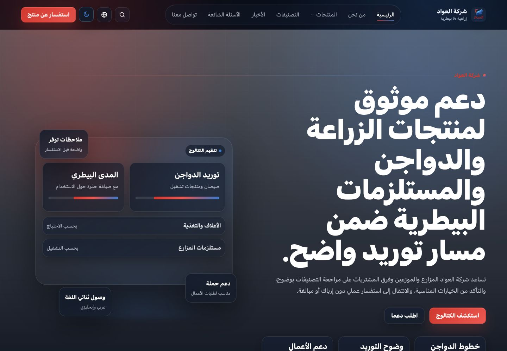
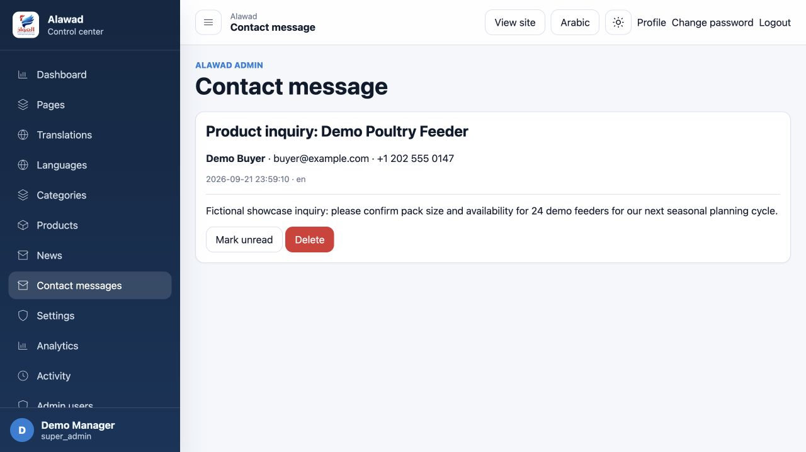
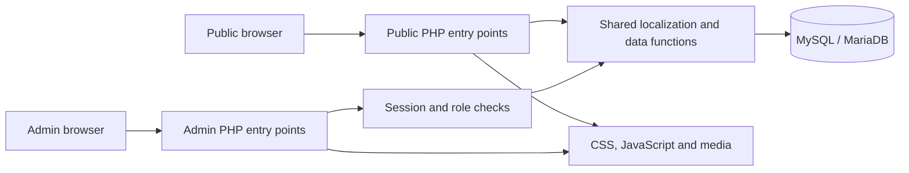

# Alawad

**A bilingual supply catalog with content and inquiry administration.**

Alawad helps visitors explore agricultural, poultry and veterinary supply products, review product details and send structured inquiries. Its administration interface connects that public journey to the content and messages behind it.


Developed by **Ragıp Mullamusa**, Founder & Software Engineer at **Ideabat**.

## From product discovery to review

A visitor browses categories, opens a product and follows a product-specific inquiry link. The PHP handler validates the submission and stores the request with its product context. An administrator can open the resulting message and track its read status.

The same administration interface maintains catalog and editorial content. Product records combine shared fields with localized titles, slugs and descriptions, so a saved content edit can appear on the corresponding public page.

| Interface | Audience | Main capabilities |
| --- | --- | --- |
| Public website | Supply buyers, farms, distributors and procurement audiences | Categories, products, details, inquiries, news and informational pages |
| Administration | `admin` and `super_admin` users | Content, translations, languages, inquiry review, settings, activity and visit analytics |
| Shared PHP layer | Both interfaces | PDO access, localization, routing helpers, catalog eligibility, sessions and tracking |

These are two web interfaces in one application. No separate mobile or desktop application was found.

## Capabilities

- **Catalog organization:** nested categories, product details, featured items, gallery fields and related content.
- **Inquiry handling:** product-aware contact forms, persisted messages and administrative read/unread handling.
- **Content operations:** shared management modules for pages, categories, products and news, with localized fields and publication controls.
- **Bilingual presentation:** English LTR and Arabic RTL across the public and admin interfaces, plus built-in light/dark themes.
- **Administrative access:** session authentication and a role boundary that reserves account management for `super_admin`.
- **Visibility into activity:** page-view aggregates and administrative activity records.

The local verification covered inquiry submission/read-state changes, catalog editing reflected publicly, both admin roles, themes and language switching. It is not a security, performance or exhaustive feature audit. Search is incomplete in this workspace because its entry script is absent. The map area is a placeholder, and password help records a request rather than providing verified email recovery. Live release status is unconfirmed.

## Screens from the application

All images are current local browser captures. Product, inquiry and account records are fictional; any dashboard figures describe the demonstration, not customer results. Placeholder product artwork is an existing application asset.


*Product cards connect details and inquiry actions; the first card reflects a verified admin edit.*



*Arabic RTL and dark mode use the application's own controls and styles.*



*The inquiry received through the public form is available for administrative review.*

The [complete screenshot map](screenshoots/SCREENSHOT_MAP.md) includes 14 captures, localized alt text, roles, dimensions and coverage notes. Responsive public web was tested at 390×844; that is a browser viewport test, not an iOS/Android run. Admin mobile styles are present but mobile admin workflows were not tested.

## Technology and architecture

| Technology | Role |
| --- | --- |
| PHP | Server-rendered pages, form handlers, administration and shared application logic |
| PDO / MySQL-compatible database | Parameterized access to content, localized rows, inquiries and activity |
| HTML / custom CSS | Public and admin layouts, RTL/LTR presentation, responsive rules and themes |
| Vanilla JavaScript | Navigation, theme controls, gallery and asynchronous interface behavior |
| Apache rewrite configuration | Intended clean-URL routing; local verification used a temporary PHP router |



Entity tables such as `products` and `categories` pair with `product_i18n` and `category_i18n`. Content saving groups base and translated changes in a transaction. Public category eligibility checks ancestors before exposing descendants. Localized URL helpers support canonical and alternate-language metadata. These implementation choices are described with source evidence in the [claim register](#).

The application uses shared PHP functions and a shared database rather than a separate API service. Contact persistence is database-based; external links do not imply integrated payment, fulfillment, CRM or messaging services.

## Project structure

```text
index.php             Public homepage
page/                 Informational pages, catalog and news-list dispatch
category/             Category detail and product listing
product/              Product detail
news/                 Article detail
lang_code/            Localized homepage entry
admin/                Login, dashboard and administration route scripts
app/
  bootstrap.php       Shared application initialization
  config/             Application and database configuration
  functions/          Queries, localization, URLs, SEO and contact logic
  admin/              Authentication, permissions and content modules
  pages/              Public page templates
  widgets/            Shared public/admin layout fragments
  storage/            Runtime storage; not a publication asset
assets/               Styles, JavaScript, fonts and media
database/            Existing SQL export; review privately before use
```

## Local development

The tested environment was PHP **8.2.4** with MariaDB **10.4.28** on macOS. Source uses PHP 8.1+ constructs; other versions have not been verified. No Composer/npm manifest, dependency lockfile, compilation step or repository test suite was found.

1. Use a disposable local copy and a newly created database. The existing SQL file contains data and must be reviewed/filtered before import; do not restore it into an existing environment or publish it.
2. Set `DB_HOST`, `DB_PORT`, `DB_NAME`, `DB_USER`, `DB_PASS` and `DB_CHARSET` in the copy's `app/config/database.php`. This configuration currently uses constants, not environment-variable overrides.
3. Provide PDO MySQL, mbstring, fileinfo and session support. Ensure the copy's `app/storage/sessions` is writable; image upload workflows also need writable upload storage.
4. Serve the project through PHP and clean-route handling. `.htaccess` describes the Apache routes. A plain `php -S` without a router does not reproduce all routes.
5. Use synthetic accounts/content and isolate outbound side effects before interacting with forms.

The [sanitized runbook](#) records the exact isolated database/PHP commands used, local restart instructions, tested workflows and cleanup. The original workspace configuration was left unchanged. Apache deployment, production services and upload/delete flows were not tested.

Syntax validation executed successfully for all 91 PHP files:

```sh
find . -name '*.php' -type f -exec php -l {} \;
```

## Developer and project materials

[Ideabat](https://ideabat.com) — Product Engineering & Operational Software  
[Ragıp Mullamusa](https://ceo.ideabat.com) · [LinkedIn](https://www.linkedin.com/in/ragipmullamusa/)

The [publishing kit](#) contains technical evidence, personal/company drafts and separate English, Arabic and Turkish website content. Turkish is a publishing language, not an implemented application language. No public project URL or release date is asserted.

No license file was present in this workspace. No license is inferred or added. Review configuration, stored sessions and the SQL export separately before making the source public; the publishing kit does not certify the repository as safe to release.
