# Screenshot map

14 current browser captures, visually inspected. All inquiry/account records are fictional; dashboard counts describe local fixtures and visits. Exports are byte-identical PNG copies.

## S07 — Content dashboard

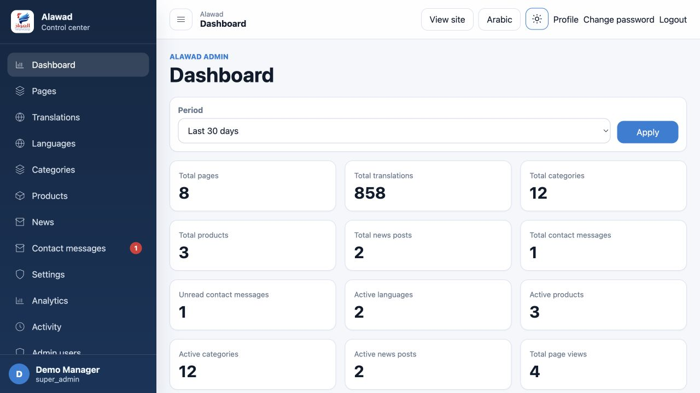

Super administrator dashboard with local demonstration content and visit counts.

Order: 7. Demonstrates: C05, C06. Use: social, case-study. Variant: super_admin, en/ltr, light, 65536×4292542531. Crop: preserve text and demo labels. [Portable export](exports/07-admin-web-super-admin-en-ltr-light-desktop-dashboard.png).

## S08 — Inquiry review

Administrator reads the saved fictional product inquiry from Demo Buyer.

Order: 8. Demonstrates: C02. Use: README, portfolio, case-study. Variant: super_admin, en/ltr, light, 65536×4292542531. Crop: preserve text and demo labels. [Portable export](exports/08-admin-web-super-admin-en-ltr-light-desktop-inquiry.png).

## S09 — Catalog administration

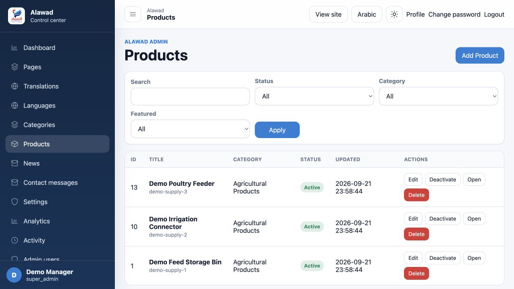

Super administrator product list with three fictional items and editing controls.

Order: 9. Demonstrates: C03, C05. Use: social, case-study. Variant: super_admin, en/ltr, light, 65536×4292542531. Crop: preserve text and demo labels. [Portable export](exports/09-admin-web-super-admin-en-ltr-light-desktop-products.png).

## S10 — Arabic administration

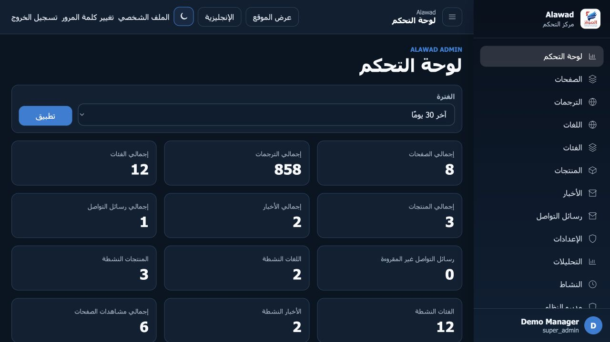

Arabic right-to-left dashboard with the built-in dark admin theme.

Order: 10. Demonstrates: C04, C05. Use: social, case-study. Variant: super_admin, ar/rtl, dark, 65536×4292542531. Crop: preserve text and demo labels. [Portable export](exports/10-admin-web-super-admin-ar-rtl-dark-desktop-dashboard.png).

## S11 — Editor role

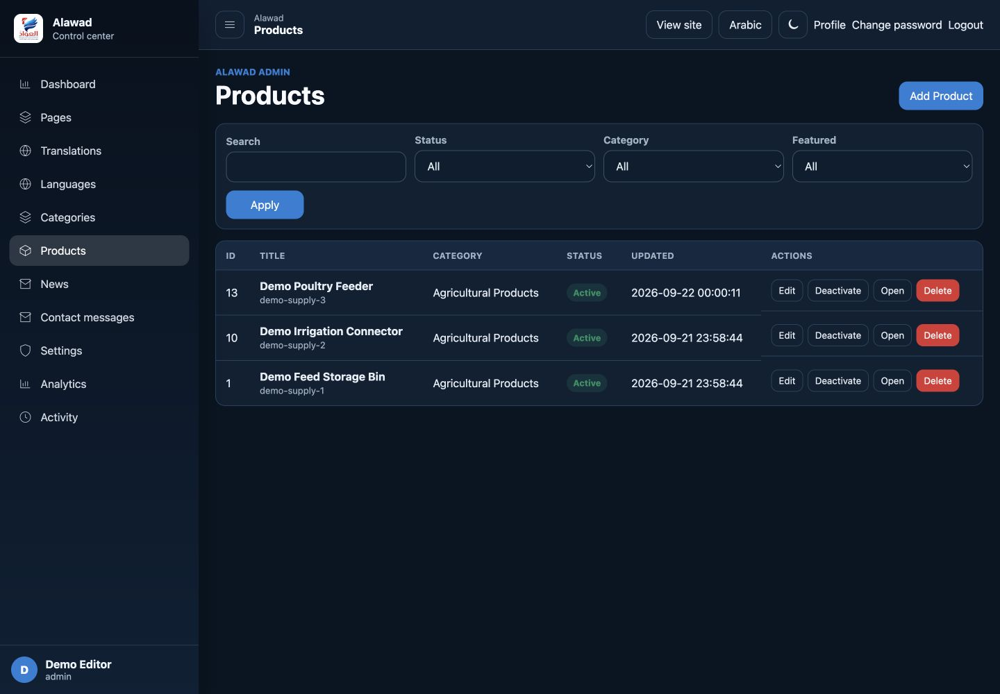

Regular administrator manages fictional products; account management is absent from navigation.

Order: 11. Demonstrates: C03, C05. Use: social, case-study. Variant: admin, en/ltr, dark, 65536×4292542531. Crop: preserve text and demo labels. [Portable export](exports/11-admin-web-admin-en-ltr-dark-desktop-products.png).

## S12 — Localized content editor

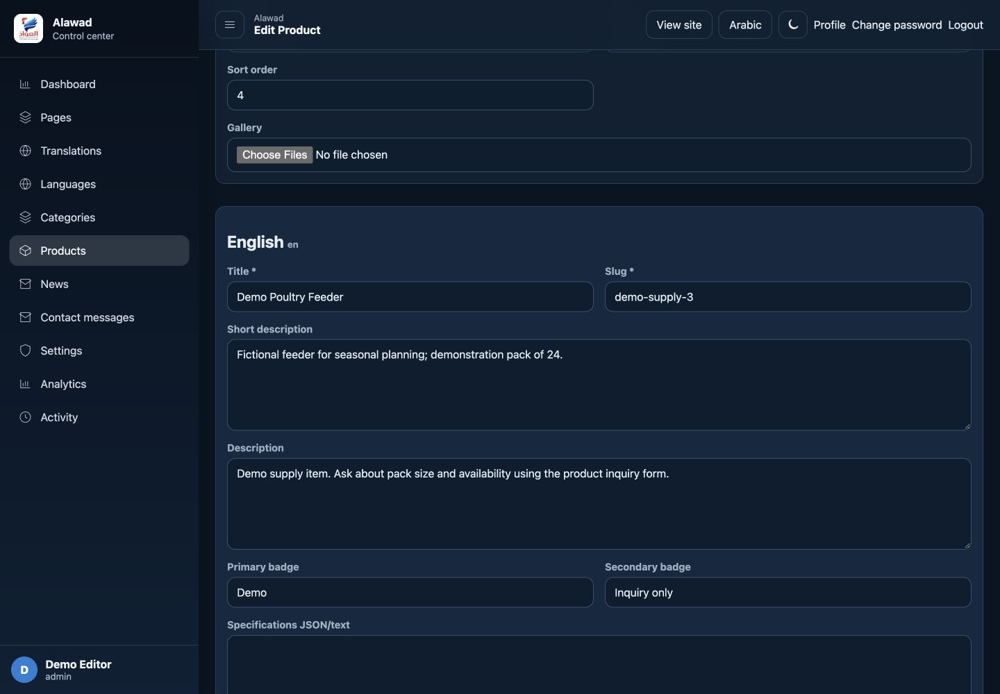

Product editor showing the saved English description for a fictional feeder.

Order: 12. Demonstrates: C03. Use: social, case-study. Variant: admin, en/ltr, dark, 65536×4292542531. Crop: preserve text and demo labels. [Portable export](exports/12-admin-web-admin-en-ltr-dark-desktop-edit-product.png).

## S14 — Local visit analytics

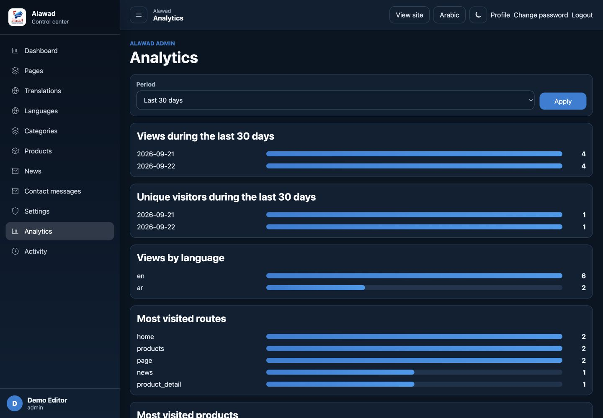

Analytics charts generated by local browser visits; these are demonstration figures.

Order: 14. Demonstrates: C06. Use: social, case-study. Variant: admin, en/ltr, dark, 65536×4292542531. Crop: preserve text and demo labels. [Portable export](exports/14-admin-web-admin-en-ltr-dark-desktop-analytics.png).

## S01 — Public website overview

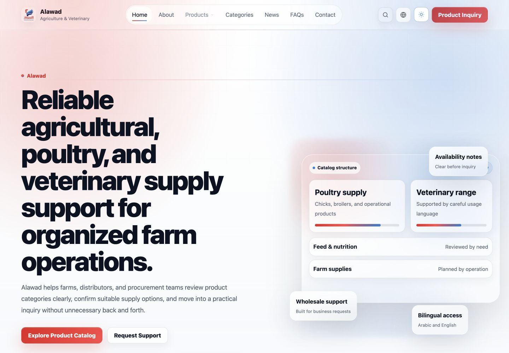

Alawad English homepage with product catalog and inquiry actions.

Order: 1. Demonstrates: C01, C04. Use: README, portfolio, case-study. Variant: visitor, en/ltr, light, 65536×4292542531. Crop: preserve text and demo labels. [Portable export](exports/01-public-web-visitor-en-ltr-light-desktop-home.png).

## S02 — Catalog with synthetic products

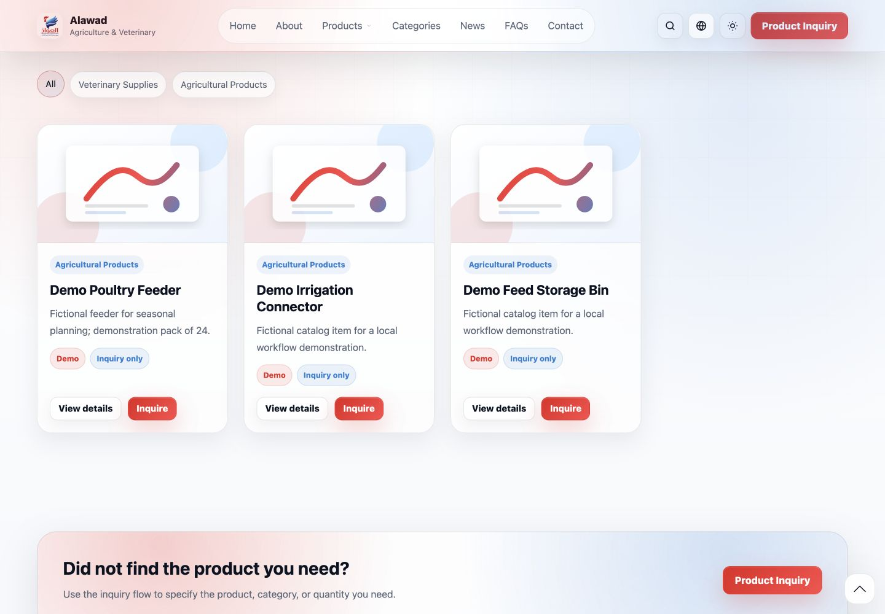

Three fictional supply products with details and inquiry buttons.

Order: 2. Demonstrates: C01, C03. Use: README, portfolio, case-study. Variant: visitor, en/ltr, light, 65536×4292542531. Crop: preserve text and demo labels. [Portable export](exports/02-public-web-visitor-en-ltr-light-desktop-catalog.png).

## S03 — Product to inquiry

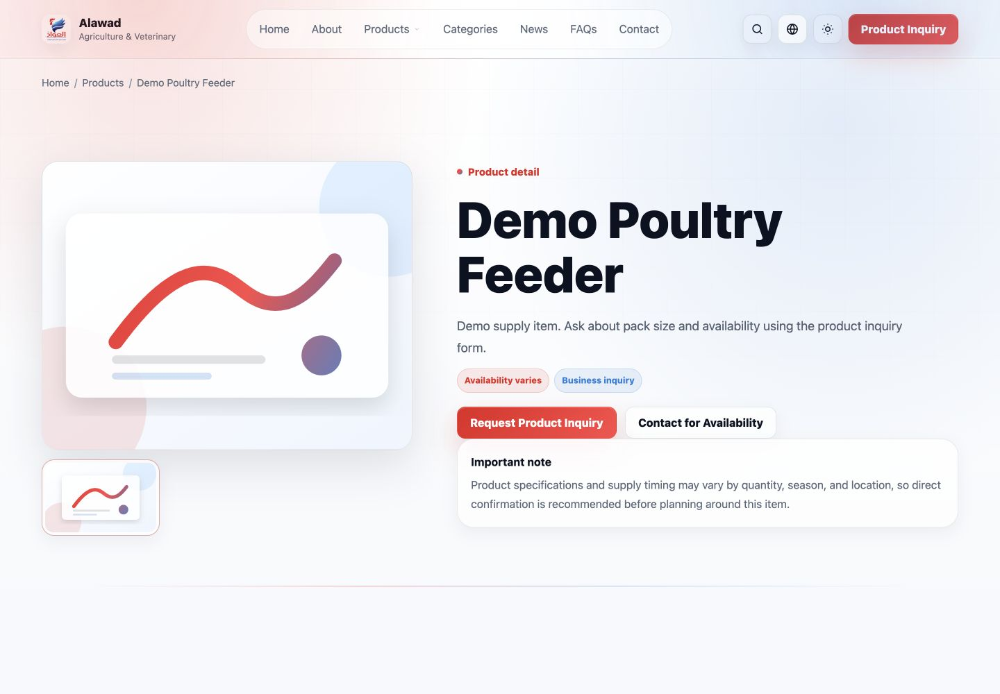

Fictional poultry feeder detail page with a product inquiry action.

Order: 3. Demonstrates: C01, C02. Use: README, portfolio, case-study. Variant: visitor, en/ltr, light, 65536×4292542531. Crop: preserve text and demo labels. [Portable export](exports/03-public-web-visitor-en-ltr-light-desktop-product.png).

## S04 — Inquiry saved

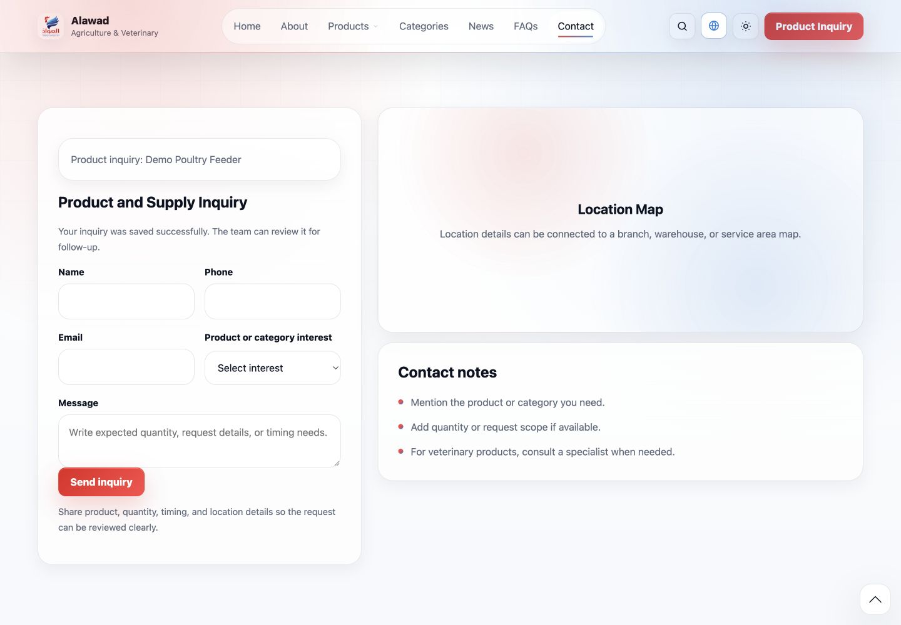

Public form confirms that the fictional product inquiry was saved. The adjacent map is an unconnected placeholder.

Order: 4. Demonstrates: C02. Use: social, case-study. Variant: visitor, en/ltr, light, 65536×4292542531. Crop: preserve text and demo labels. [Portable export](exports/04-public-web-visitor-en-ltr-light-desktop-inquiry-saved.png).

## S05 — Arabic dark homepage

Arabic right-to-left homepage using the built-in dark theme.

Order: 5. Demonstrates: C04. Use: README, portfolio, case-study. Variant: visitor, ar/rtl, dark, 65536×4292542531. Crop: preserve text and demo labels. [Portable export](exports/05-public-web-visitor-ar-rtl-dark-desktop-home.png).

## S06 — Arabic responsive homepage

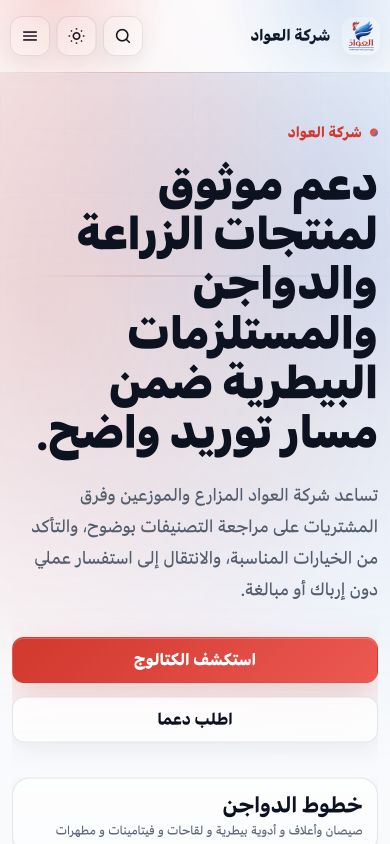

Arabic homepage in a 390-pixel-wide browser viewport, with mobile menu controls.

Order: 6. Demonstrates: C04. Use: social, case-study. Variant: visitor, ar/rtl, light, 65536×4292542531. Crop: preserve text and demo labels. [Portable export](exports/06-public-web-visitor-ar-rtl-light-mobile-home.png).

## S13 — Editorial content

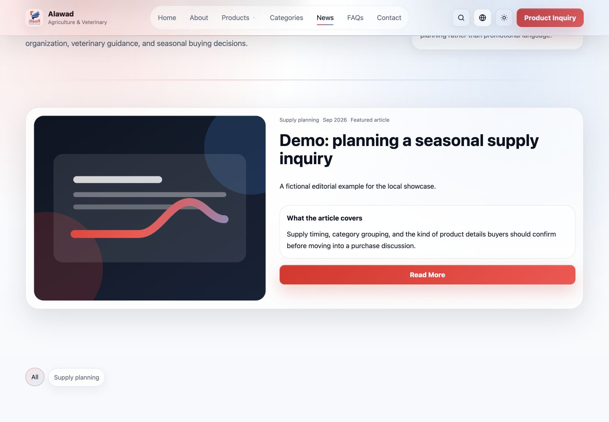

Featured news card containing a fictional seasonal supply planning article.

Order: 13. Demonstrates: C07. Use: social, case-study. Variant: visitor, en/ltr, light, 65536×4292542531. Crop: preserve text and demo labels. [Portable export](exports/13-public-web-visitor-en-ltr-light-desktop-news.png).

## Coverage

Both independent interfaces are covered. S06 is responsive web, not an iOS/Android application. Admin mobile CSS was inspected but mobile admin workflows were not tested. Secondary CRUD screens are represented by the product editor rather than a screenshot of every table. Search is blocked by the missing entry script and is excluded from promotional imagery. S04 deliberately retains the real unconnected map placeholder; it does not establish map integration.
